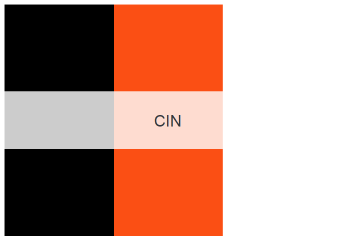
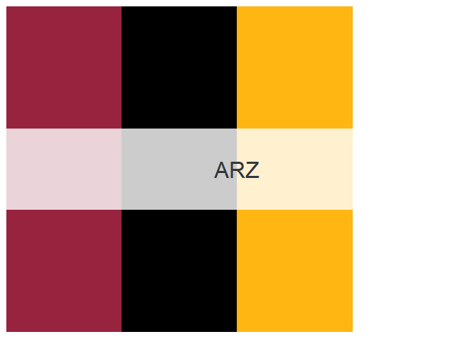

<!-- README.md is generated from README.Rmd. Please edit that file -->

# nflcolors

<!-- badges: start -->
<!-- badges: end -->

The goal of nflcolors is to provide easy access to NFL team colors and
palettes.

## Installation

You can install nflcolors from [GitHub](https://github.com/) with:

``` r
# install.packages("devtools")
devtools::install_github("corysauve/nflcolors")
```

## Basic Usage

nflcolors has palettes for all 32 teams in the National Football League
(NFL). Colors are sourced from primary uniforms and logos. All teams are
accessed via their team abbreviation.

``` r
library(nflcolors)

names(teams)
#>  [1] "ARZ" "ATL" "BAL" "BUF" "CAR" "CHI" "CIN" "CLE" "DAL" "DEN" "DET" "GB" 
#> [13] "HOU" "IND" "JAX" "KC"  "LAC" "LAR" "LV"  "MIA" "MIN" "NE"  "NO"  "NYG"
#> [25] "NYJ" "PHI" "PIT" "SF"  "SEA" "TB"  "TEN" "WAS"
```

You can create a team palette with `team_colors()`, along with an image
of the palette.

``` r
kc_palette <- team_colors("KC")
```

You can also select a specific number of colors.

``` r
kc_palette <- team_colors("KC", 2)
```

## Available Team Palettes

-   [**AFC South**](#AFC-South)
-   [**AFC East**](#AFC-East)
-   [**AFC North**](#AFC-North)
-   [**AFC West**](#AFC-West)
-   [**NFC South**](#NFC-South)
-   [**NFC East**](#NFC-East)
-   [**NFC North**](#NFC-North)
-   [**NFC West**](#NFC-West)

<br>

### AFC South


<br>

### AFC East


<br>

### AFC North



<br>

### AFC West


<br>

### NFC South


<br>

### NFC East


<br>

### NFC North


<br>

### NFC West



<br>

## Contributing

I welcome any contributions or suggestions for improving the package!
Please open an issue to do so.

## License

The nflcolors package is licensed under the MIT License. Please see the
[LICENSE](LICENSE.md) for more details.

## Acknowledgments

Inspiration for this package originally came from the wonderful
[nationalparkcolors](https://github.com/katiejolly/nationalparkcolors)
package, which provides color palettes for various National Park
posters.
