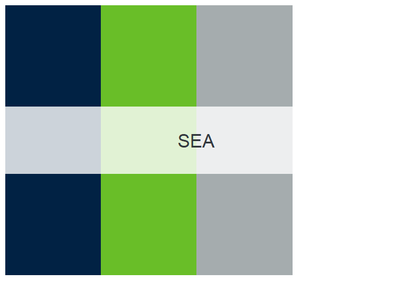
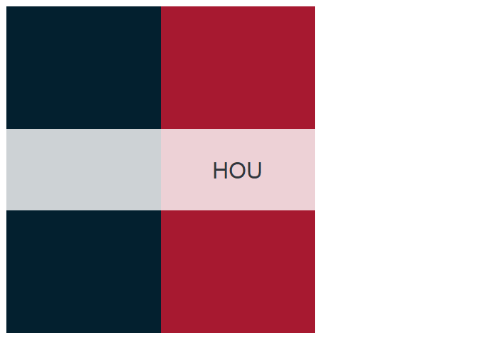

<!-- README.md is generated from README.Rmd. Please edit that file -->

# nflcolors

<!-- badges: start -->
<!-- badges: end -->

The goal of nflcolors is to provide

## Installation

You can install nflcolors from [GitHub](https://github.com/) with:

``` r
# install.packages("devtools")
devtools::install_github("corysauve/nflcolors")
```

## Basic Usage

`nflcolors` has palettes for all 32 teams in the National Football
League (NFL). Colors are sourced from primary uniforms and logos. All
teams are accessed via their team abbreviation.

``` r
library(nflcolors)

names(teams)
#>  [1] "ARZ" "ATL" "BAL" "BUF" "CAR" "CHI" "CIN" "CLE" "DAL" "DEN" "DET" "GB" 
#> [13] "HOU" "IND" "JAX" "KC"  "LAC" "LAR" "LV"  "MIA" "MIN" "NE"  "NO"  "NYG"
#> [25] "NYJ" "PHI" "PIT" "SF"  "SEA" "TB"  "TEN" "WAS"
```

You can create a team palette with `team_colors()`, along with an image
of the palette.

``` r
kc_palette <- team_colors("KC")
```

You can also select a specific number of colors.

``` r
kc_palette <- team_colors("KC", 2)
```

## Available Palettes


